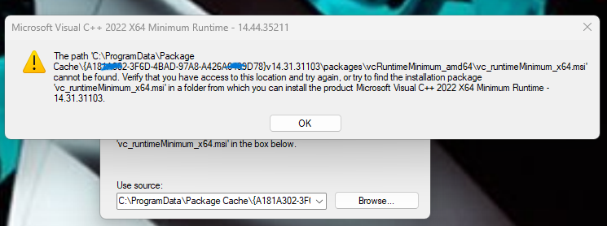

# UNIVERSAL vc-runtime-package-cache-fix
Easy 1-Click Fix for broken Microsoft Visual C++ Package Cache on Windows 10/11

Why This Exists

After hours of searching for a quick and reliable fix, I found that no clear solution existed for this issue.
Most guides were outdated, incomplete, or overly complicated — and none worked consistently.
Common recommendations included reinstalling Visual C++, repairing Windows or editing the registry — none of which reliably fixed the broken Package Cache problem.

After encountering this issue multiple times across different systems, I decided to stop wasting time and create a single, automated, one-click solution that actually works.

The Goal

This project exists to provide:
- one simple script
- no guesswork
- no manual folder creation
- no risky registry edits

Just:

> run → fix → done  [Run as Administrator or it wont work!]

If this repository saves you hours of frustration, then it has done exactly what it was created for

--------------------------------------------------------------------------------------------------------------

## How It Works

This script repairs a broken Microsoft Visual C++ Package Cache by restoring only the installer files that Windows expects to find.

### 1. Downloading the official VC++ redistributable

The script downloads the official Microsoft Visual C++ 2015–2022 Redistributable directly from Microsoft.  
No third-party installers or modified files are used.

### 2. Extracting the required MSI files

Instead of running the installer, the script uses Microsoft’s supported `/layout` option to extract the real MSI files:

- `vc_runtimeMinimum_x64.msi`
- `vc_runtimeAdditional_x64.msi`

These are the exact files Windows Installer requires for repair, update, or uninstall operations.

### 3. Detecting existing Package Cache entries

Windows stores installer metadata in:

C:\ProgramData\Package Cache

Each Visual C++ installation is identified by a unique GUID and a version folder such as `v14.xx.xxxxx`.

The script scans all existing entries to locate where Windows expects the missing files.

### 4. Restoring missing cache files

For each detected Visual C++ entry, the script recreates missing folder structures and restores the required MSI files under:

- `vcRuntimeMinimum_amd64`
- `vcRuntimeAdditional_amd64`

Only missing files are added. Existing files are not modified.

### 5. Completing the repair

Once the files are restored, Windows Installer can successfully complete its repair process, allowing applications and installers to run normally again.

### Why this is safe

- Uses official Microsoft downloads only  
- Does not modify the registry  
- Does not alter system binaries  
- Restores files originally created by Windows Installer  

In short, the script does not modify Visual C++ itself.  
It restores the installer state that Windows lost.
